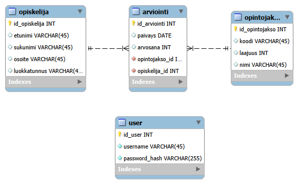

# Ankkalinnan opintorekisteri ja sen REST-API rajapinta.

Tässä projektissa oli tarkoituksena luoda opintorekisteri ja REST-API rajapinta sen käyttämiseksi. Sovellus projektin rakentamisessa käytettiin Node.js, Express ja mySQL teknologioita ja itse sovellus sijoitettiin pilvipalveluun.

Projektissa käytetään MVC-arkkitehtuuria, JWT-autentikointia ja bcrypt salausta.

## Ohjelman käyttäminen 

Tietokanta on suojattu token-autentikoinnilla. Sovellusta käyttääkseen on luotava käyttäjä user tauluun POST /user
Sisään kirjautuminen tapahtuu POST /login kautta, johon on lähetettävä tunnukset ja salasana .json formaatissa:
{
    "username":"uname",
    "password":"passw"
}
Vastauksena saat JWT-tokenin, joka sinun on lisättävä headerina mukaan kaikkiin pyyntöihin:
Authorization Bearer <token>

Tietokannassa on kiinnostuksen kohteena seuraavat kuvitteellista tietoa sisältävät taulut, joiden reitit on suojattu:

/opiskelija
/opintojakso
/arviointi

Näiden taulujen lisäksi tietokantaan on lisätty taulu käyttäjätiedoille /users.

Kyseisten taulujen tietoja voidaan tarkkailla esim. Posmanilla tai vastaavalla sovelluksella. Tietoja haetaan tyylillä <osoite:3000>/<taulun nimi>. 
Tauluista voidaan myös hakea yksittäisiä taulukoita viitaten taulun pää-avaimen id numeroon: esim. <osoite:3000>/<taulun nimi>/<id>. 

Rajapinnan avulla tietokannasta pystytään hakemaan, lisäämään, poistamaan ja muokkaamaan tietoja ja näin ollen se tukee seuraavia HTTP-komentoja:

GET             Kaikkien tietojen lukeminen.                 
GET /ID         Yksittäisen tietueen lukeminen ID:n perusteella.    
POST            Tietueen lisääminen tietokantaan.                   
DELETE          Tietueen poistaminen ID:n perusteella.              
PUT             Tietueen päivittäminen ID:n perusteella.            

Tietokannasta löytyy myös aliohjelma "CALL hae_suoritukset(opiskelija_id);", jolla voidaan hakea kaikki tietyn opiskelijan suoritukset opiskelija_id:n avulla. Tätä voidaan käyttää API-kutsulla GET /haesuoritukset/<id>

## Tietokannan ER-diagrammi:

